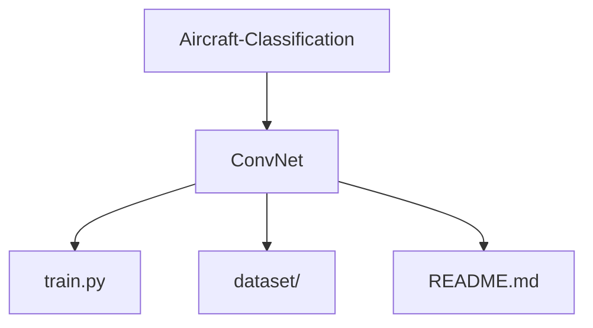

# ACAI-ConvNet

## Abstract

This project addresses the challenge of identifying military aircraft from aerial images using computer vision (CV) techniques. For this project, we created a dataset of labeled aircraft using RoboFlow to demonstrate the capabilities of our models to learn and recognize different vehicles. We then applied data augmentation techniques to increase the effectiveness of our dataset and models.

The study explores the performance of three different CV models—YOLOv5, YOLOv8, and a custom deep learning implementation (ConvNet) built using PyTorch. YOLOv5 and YOLOv8, designed and documented by Ultralytics, were implemented as baseline models for comparison. Our custom model was designed to address shortcomings observed in the baseline models, focusing on balancing computational efficiency and detection accuracy. By evaluating these models, we identified performance trade-offs and gained valuable insights into optimizing CV models for accurate aircraft detection in realistic datasets.

---

## GitHub Repository Structure

This repository is a submodule of the Aircraft Classification from Arial Imagery repo linked in the about section:



---

## Evaluation Metrics

Evaluation metrics can be found in the "logs" folder after the code has been run. This will include the following:

- **Confusion Matricies**
- **Precision-Confidence Curves**
- **Recall-Confidence Curves**
- **Precision-Recall Curves**
- **F1-Confidence Curves**
- **Epoch Accuracy and Loss Curves**

---

## Getting Started

### **Prerequisites**

- Python 3.8 or higher
- Required Python packages: Listed in `requirements.txt` within each model submodule
- CUDA-enabled GPU (recommended)

### **Commands**

Run the following command to install required libraries:

```bash
    pip install -r requirements.txt
```

Run the following command to get the test results from the report:

```bash
    python train.py --learning_rate 0.00005 --num_epochs 30 --batch_size 16 --log_dir 'logs' --num_classes 5 --class_weight 1.0
```

---

## Authors

**Alexander Green** &nbsp;&nbsp;&nbsp;&nbsp;&nbsp; Master of Science in Computer Engineering (MSCpE)<br>
Dept. of Electrical and Computer Engineering, University of Central Florida<br>
[GitHub Home](https://github.com/alexneilgreen)

**Joshua Glaspey** &nbsp;&nbsp;&nbsp;&nbsp;&nbsp;&nbsp;&nbsp; Master of Science in Computer Engineering (MSCpE)<br>
Dept. of Electrical and Computer Engineering, University of Central Florida<br>
[GitHub Home](https://github.com/jkglaspey)
